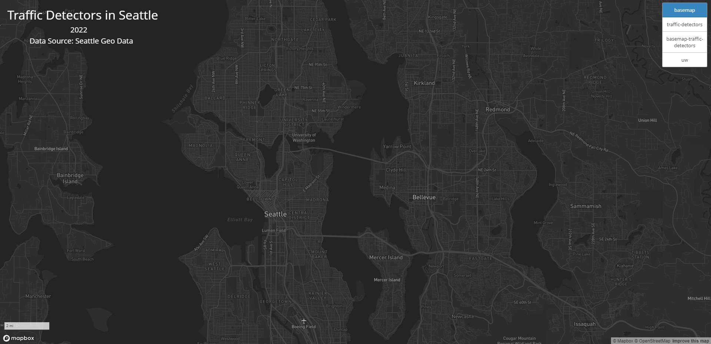
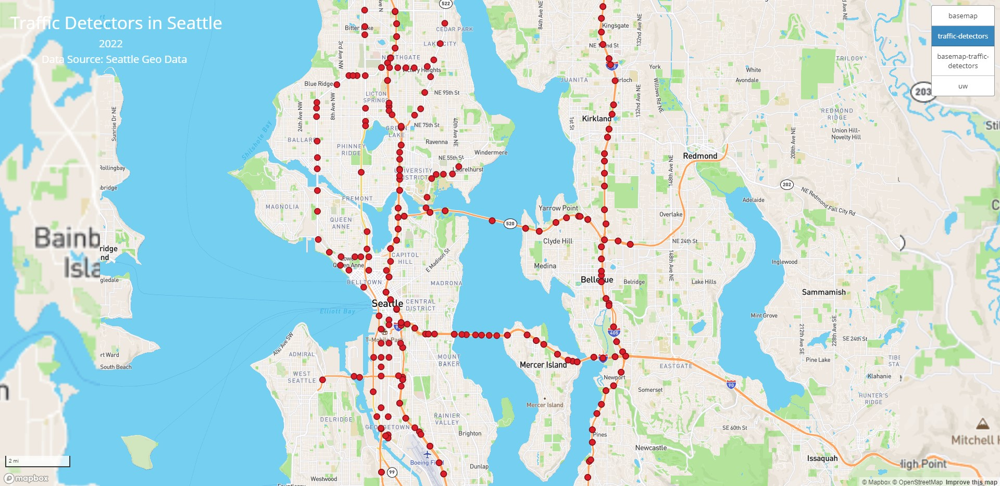
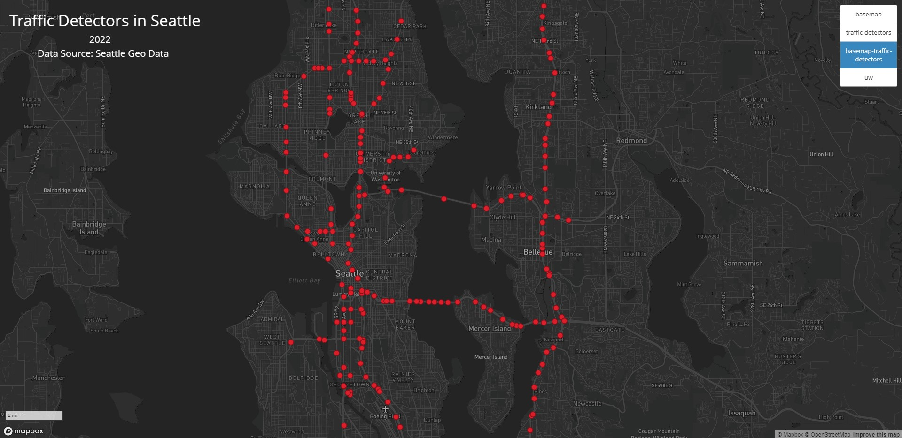
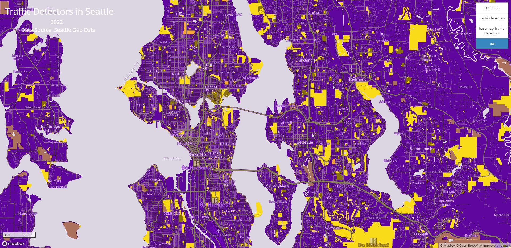

# Seattle-Traffic-Detectors-and-UW-Theme
Link to webmap: https://vinceleuw.github.io/Seattle-Traffic-Detectors-and-UW-Theme/

For this lab, the geographic area that I wanted to examine was of Seattle, Washington. There are 4 tilesets included in this webmap, which are the dark monochrome Mapbox basemap, a layer which includes the traffic detectors in Seattle, a layer which includes both the basemap layer and the traffic detectors, and lastly, a UW themed map layer. As for zoom control of each layer, each layer uses the same inimum zoom level of 9, and a maximum zoom layer of 14. The data of traffic detectors is provided by Seattle Geo Data.

Below are screenshots of each layer

This layer acts as an alternate basemap provided by Mapbox

This layer maps out all traffic detectors in the Seattle metro area.

This layer maps out all traffic detectors in the Seattle metro area overlayed on the previous basemap layer.

This layer is a themetic layer based off of the UW colors.